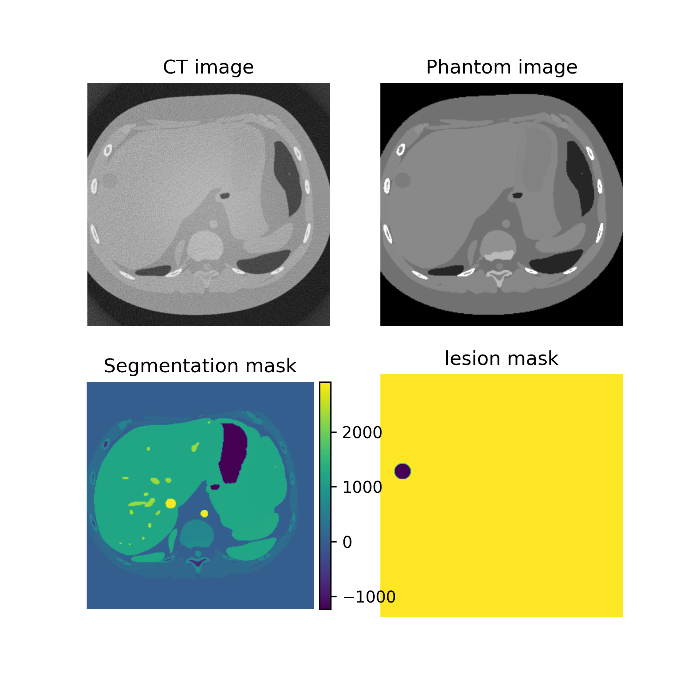

# Virtual CT Dataset for AI Device Evaluation

This repo contains tools for making virtual CT datasets using realistic anthropomorphic phantoms from the [pediatric XCAT Cohort](https://aapm.onlinelibrary.wiley.com/doi/full/10.1118/1.4926847) and the [XCIST CT simulator platform](https://github.com/xcist). Parameters are included to [insert lesions](lesions.py) randomly positioned in a selected organ of interest (default = liver).

Together these tools make it possible to simulate a wide range of scanner characterstics, image acquisition techniques, as well as patient and lesion characteristics while maintaining access to predefined ground truth data. This ground truth data includes noise-less and blur free attenuation cross-sections for evaluating denoising, super resolution and other image enhancement devices, as well as segmentation masks for detection and segmentation devices.

Meta data including patient age, sex, height, weight, ethnicity and more are also associated with every simulated image.

## Getting Started

[view_images.ipynb](view_images.ipynb) demonstrates how to access images and meta data from the dataset

For more information on how the dataset was organized and made see the [making_a_dataset.ipynb](making_a_dataset.ipynb) notebook. This also provides details on how to control different aspects of dataset creation.

## Other Key Files

- [runRender_peds.py](runRender_peds.py): runs CT simulations in serial that are then organized into a dataset
- [submit_all_renders.sh](submit_all_renders.sh): runs CT simulations in parallel on Betsy

## Questions

Please contact [brandon.nelson@fda.hhs.gov](mailto:[brandon.nelson@fda.hhs.gov])